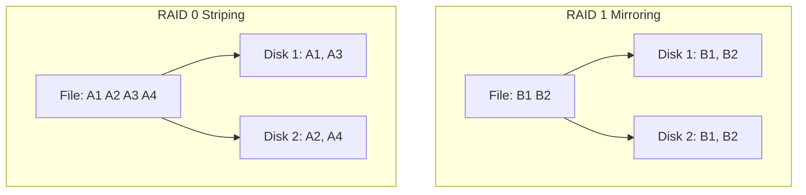

Links: [[00 Operating System]]
___
# Disk Scheduling and Management

## Disk Structure

- **Platters:** Circular magnetic plates.
- **Tracks:** Concentric circles on a platter.
- **Sectors:** Smallest unit of storage (usually 512 bytes).
- **Cylinders:** The set of tracks at the same position on all platters.
- **Seek Time:** Time to move the disk arm to the desired cylinder.
- **Rotational Latency:** Time for the desired sector to rotate under the disk head.
- **Transfer Time:** Time to actually read/write the data.

$$ \text{Access Time} = \text{Seek Time} + \text{Rotational Latency} + \text{Transfer Time} $$

## Disk Scheduling Algorithms

The OS must decide the order of I/O requests to minimize **Seek Time**.

**Request Queue:** `98, 183, 37, 122, 14, 124, 65, 67`
**Head Start:** `53`

### FCFS (First-Come, First-Served)

Process requests in the order they arrive.

- **Order:** 53 -> 98 -> 183 -> 37 -> 122 -> 14 -> 124 -> 65 -> 67
- **Total Head Movement:** `|98-53| + |183-98| + ...` = **640 cylinders**.
- **Pros:** Fair.
- **Cons:** Very poor performance (Zig-zag movement).

### SSTF (Shortest Seek Time First)

Select the request closest to the current head position.

- **Order:** 53 -> 65 -> 67 -> 37 -> 14 -> 98 -> 122 -> 124 -> 183
- **Total Head Movement:** **236 cylinders**.
- **Pros:** Better performance than FCFS.
- **Cons:** Starvation (requests far away may never be served).

### SCAN (Elevator Algorithm)

The head moves in one direction (e.g., towards 0), servicing requests. When it hits the end, it reverses.

- **Order (Assuming moving towards 0):** 53 -> 37 -> 14 -> 0 -> 65 -> 67 -> 98 -> 122 -> 124 -> 183
- **Total Head Movement:** **208 cylinders**. (53 to 0, then 0 to 183).
- **Pros:** No starvation.

### C-SCAN (Circular SCAN)

Like SCAN, but when it hits the end, it immediately returns to the beginning _without_ servicing requests on the return trip.

- **Order:** 53 -> 65 -> 67 -> 98 -> 122 -> 124 -> 183 -> 199 -> 0 -> 14 -> 37
- **Pros:** Provides more uniform wait time.

### LOOK / C-LOOK

Optimization of SCAN/C-SCAN. The head only goes as far as the _last request_ in each direction, not to the physical end of the disk (0 or 199).

- **LOOK Order:** 53 -> 37 -> 14 -> 65 -> ... (Reverses at 14, not 0).

## RAID (Redundant Array of Independent Disks)

A technology that combines multiple physical disk drives into a single logical unit for data redundancy and/or performance.

### RAID Levels

| Level       | Name                     | Description                                             | Pros                                                                                        | Cons                                                    |
| :---------- | :----------------------- | :------------------------------------------------------ | :------------------------------------------------------------------------------------------ | :------------------------------------------------------ |
| **RAID 0**  | **Striping**             | Splits data evenly across two or more disks.            | **High Performance** (Read/Write speed is multiplied).                                      | **No Redundancy**. If one disk fails, ALL data is lost. |
| **RAID 1**  | **Mirroring**            | Writes the exact same data to two disks simultaneously. | **High Reliability**. If one fails, the other works.                                        | **High Cost**. Uses 50% of storage for backup.          |
| **RAID 5**  | **Striping with Parity** | Stripes data and parity information across 3+ disks.    | **Balance** of performance, storage efficiency, and redundancy. Can survive 1 disk failure. | Slower write speeds (calculating parity).               |
| **RAID 10** | **1 + 0**                | A stripe of mirrors. Nested RAID.                       | Best of both worlds (Speed of RAID 0, Reliability of RAID 1).                               | Very expensive (needs at least 4 disks).                |

#### RAID 0 vs RAID 1 Diagram

