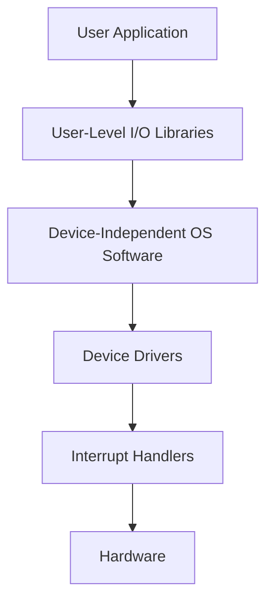

Links: [[19 Secondary Memory]]
___
# File Systems and I/O Management

## File Systems

A **File System** is the method and data structure that an operating system uses to control how data is stored and retrieved. Without a file system, data placed in a storage medium would be one large body of data with no way to tell where one piece of information stops and the next begins.

### Windows File Systems

1.  **FAT32 (File Allocation Table 32):**
    - **Pros:** Universally supported (Windows, Mac, Linux, Game Consoles).
    - **Cons:** Max file size is 4GB. Max partition size is 32GB (in Windows). No security permissions.
2.  **NTFS (New Technology File System):**
    - The default for modern Windows.
    - **Pros:** Supports huge files/partitions. Supports file permissions (ACLs), encryption (EFS), and compression. Journaling (recovers quickly from crashes).
    - **Cons:** Read-only on macOS (by default).
3.  **exFAT (Extended FAT):**
    - Designed for flash drives.
    - **Pros:** No 4GB limit. Compatible with Windows and Mac.
    - **Cons:** No journaling (less reliable than NTFS).

### Linux File Systems

1.  **ext4 (Fourth Extended Filesystem):**
    - The default for most Linux distributions.
    - **Pros:** Fast, stable, supports journaling (prevents corruption).
    - **Cons:** Not natively readable by Windows.
2.  **XFS:**
    - High-performance 64-bit journaling file system.
    - **Pros:** Excellent for handling very large files and parallel I/O.
3.  **Btrfs (B-tree FS):**
    - Modern "Copy-on-Write" (CoW) file system.
    - **Pros:** Supports snapshots, dynamic volume resizing, and self-healing (checksums).

## I/O Management

The OS manages all I/O devices (Keyboards, Disks, Networks).

### I/O Hardware

- **Port:** Connection point (e.g., USB port).
- **Bus:** Shared set of wires (e.g., PCI bus).
- **Controller:** Electronics that operate the port/bus/device (e.g., SATA controller).

### I/O Software Layers

1.  **Interrupt Handlers:** Deal with the hardware interrupt when I/O finishes.
2.  **Device Drivers:** Code that knows how to speak to the specific hardware controller. Hides details from the OS.
3.  **Device-Independent I/O Software:** Functions common to all devices (buffering, caching, error reporting).
4.  **User-Space I/O Software:** Libraries (like `stdio` in C) and Spooling systems.

#### Diagram: I/O Layers

