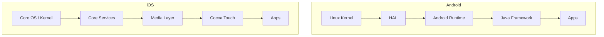

Links: [[19 Secondary Memory]]
___
# Case Studies: Mobile and Desktop OS

## Introduction to Android and Mac OS

### Mac OS (macOS)

**macOS** is a proprietary operating system developed by Apple Inc. for its Mac computers.

- **Kernel:** **XNU** (X is Not Unix). It is a hybrid kernel combining the **Mach** microkernel (for messaging/memory) and **BSD** (for file systems/networking).
- **User Interface:** **Aqua** (known for its dock and menu bar).
- **File System:** **APFS** (Apple File System) - Optimized for Flash/SSD storage, supports encryption and snapshots.
- **Architecture:** UNIX-certified. It has a command-line interface (Terminal) running `zsh` or `bash`.

### Android

**Android** is a mobile operating system based on a modified version of the **Linux kernel** and other open-source software.

- **Kernel:** **Linux** (Monolithic). It handles drivers, memory, and power management.
- **Runtime:** Uses **ART (Android Runtime)** (formerly Dalvik) to execute apps. Apps are typically written in Java/Kotlin.
- **Architecture:**
  1.  **Linux Kernel:** (Bottom) Hardware abstraction.
  2.  **HAL (Hardware Abstraction Layer):** Standard interface for camera, bluetooth, etc.
  3.  **Native Libraries:** C/C++ libraries (SQLite, OpenGL).
  4.  **Java API Framework:** Managers for Activity, Windows, Content Providers.
  5.  **System Apps:** (Top) Dialer, Email, Calendar.

## Evolution of Mobile OS: iOS vs. Android

| Feature           | Android                                                        | iOS                                            |
| :---------------- | :------------------------------------------------------------- | :--------------------------------------------- |
| **Developer**     | Google (Open Handset Alliance)                                 | Apple Inc.                                     |
| **Source Model**  | Open Source (AOSP)                                             | Closed Source (Proprietary)                    |
| **Kernel**        | Linux Kernel                                                   | XNU Kernel (Darwin)                            |
| **Customization** | High (Launchers, Widgets, Rooting)                             | Low (Strictly controlled by Apple)             |
| **App Store**     | Google Play Store (Open, more malware risk)                    | Apple App Store (Strict review, safer)         |
| **File Transfer** | Easy (USB Mass Storage)                                        | Difficult (iTunes/Finder required)             |
| **Hardware**      | Runs on devices from many manufacturers (Samsung, Pixel, etc.) | Runs ONLY on Apple hardware (iPhone, iPad)     |
| **Updates**       | Fragmented (Depends on manufacturer)                           | Consistent (All devices update simultaneously) |

### Architecture Comparison Diagram

