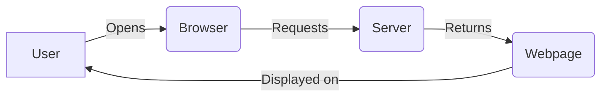
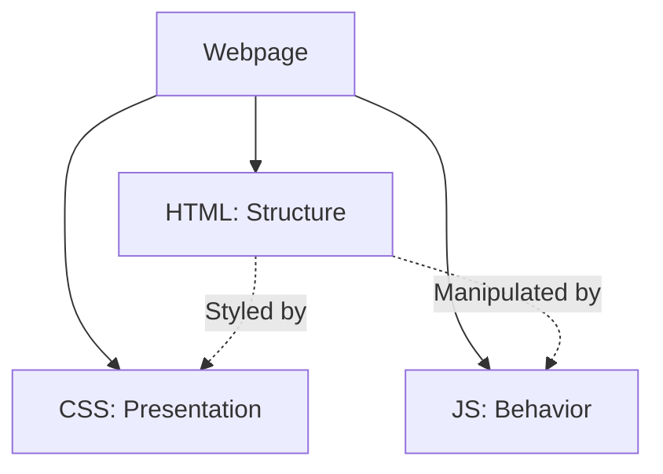

Links: 
___
# Web Technology

A collection of tools and techniques used to design, create, and display content on the internet, typically in the form of webpages.

> [!TIP] Library Analogy
> Think of **Web Technology** like the infrastructure of a **library**.
> - The **Web** is the library itself (the global space).
> - **Webpages** are the books (content).
> - The **Web Browser** is the librarian (the engine that retrieves and presents the book to you).

### Technical Explanation
Web technology encompasses the languages and protocols used to build the World Wide Web. It relies on a **Client-Server Architecture**:

- **Client (The Requestor):** Usually the **Web Browser**. It asks for information.
- **Server (The Provider):** A powerful computer that stores files (HTML, images, videos) and sends them when asked.
- **Protocol (The Language):** They communicate using **HTTP/HTTPS** (HyperText Transfer Protocol).

It involves:
- **Webpages:** Documents containing information (text, images, media).
- **Web Browser:** The **engine** that acts as a client to request, retrieve, and render these webpages for the user. Examples include Chrome, Firefox, and Edge.

> [!TIP] Browser is the Engine
> Remember the browser is the **engine**. It interprets the code (HTML/CSS/JS) and shows you the visual result.

## From Web to Mobile

As technology progressed, the web didn't stay confined to desktop computers.
- **Transition:** The "Web" moved to various platforms, most notably mobile devices like Android.
- **Compatibility:** Developers had to adapt web technologies to be compatible with mobile screens and performance constraints.
- **Application:** In this context, "Application" often refers to an **Android Application** or a **Hybrid App** that uses web tech under the hood.

> [!NOTE] Evolution of Web
> The foundation of modern app development was web designing. We started with static pages, moved to dynamic web apps, and now build mobile apps using similar paradigms (like React Native or Flutter).

#### Deployment

The process of making a software application or webpage available for use by the end-user on a specific environment (like a server or app store).

> [!TIP] Analogy
> Think of **Deployment** like **Opening a Restaurant**.
> - Building the app is like *cooking the food* and *setting up the tables* (Development).
> - **Deployment** is flipping the sign to "Detailed Open" and unlocking the front door so customers (users) can actually come in and eat.

## Components of a Webpage

> [!TIP] Analogy: Building a House
> To create a modern webpage, we generally use three core technologies. Imagine building a **House**:
>
> **HTML (HyperText Markup Language)**
> - **Role:** Structure.
> - **Function:** Defines the "bones" or layout of the document (headings, paragraphs, lists).
> - **House Analogy:** The **Skeleton**, bricks, and walls. It provides the shape but looks plain.
>
> **CSS (Cascading Style Sheets)**
> - **Role:** Design and Beautification.
> - **Function:** Controls the look and feel (colors, fonts, spacing).
> - **House Analogy:** The **Paint**, decorations, and interior design. It makes the house look good.
>
> **JS (JavaScript)**
> - **Role:** Interactivity, Logic, and Validation.
> - **Function:** Makes the page "do" things.
> - **House Analogy:** The **Electricity**, plumbing, and smart home features. It controls the lights turning on, the garage door opening, and the security system.

> [!SUCCESS] Input Validation
> **Validation:** Checks the **correctness of user input** before submitting it to a server.
> *Example:* Ensuring a user types an actual email address (`name@domain.com`) and not just random text.

| Technology     | Role      | Analogy       |
|:-------------- |:--------- |:------------- |
| **HTML**       | Structure | Skeleton      |
| **CSS**        | Style     | Skin/Makeup   |
| **JavaScript** | Behavior  | Muscles/Brain |

