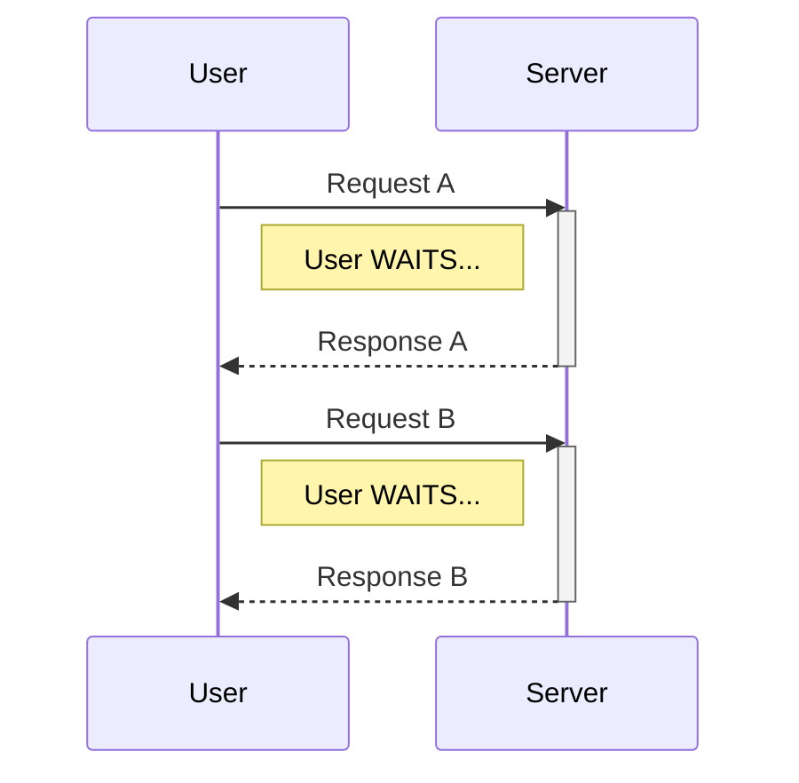
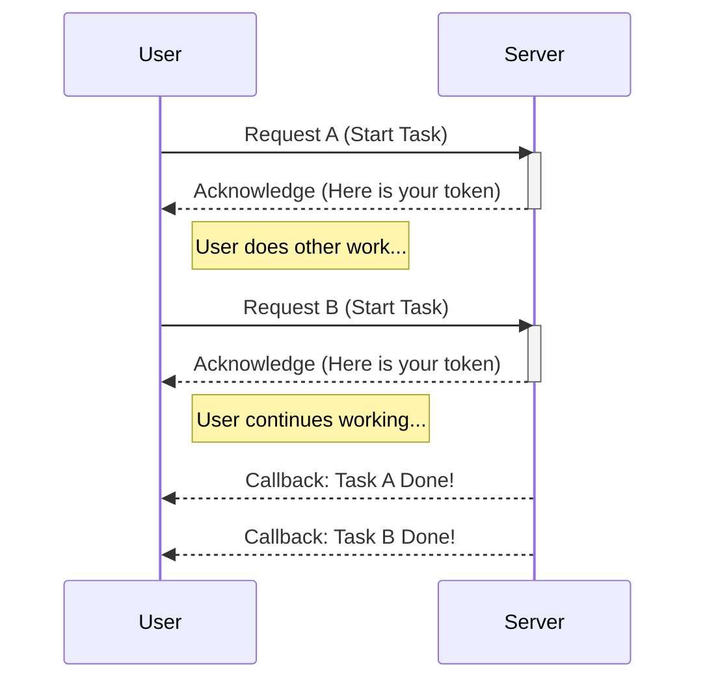
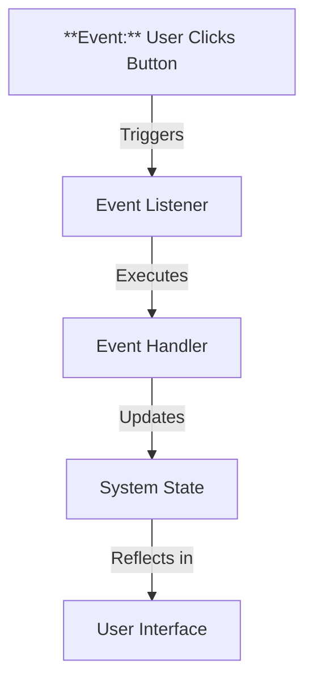

Links: 
___
# Core Programming Concepts in Web Tech

## Modular Programming

A design technique where functionality is separated into independent, interchangeable modules, such that each contains everything necessary to execute only one aspect of the desired functionality.

> [!TIP] Lego Bricks
> Think of **Lego Bricks**.
> - You build a castle using many small, separate bricks (modules).
> - If one brick breaks or you want to change the color of a specific tower, you just swap that specific brick/section without destroying the whole castle.
> - **Comparison:** A monolithic program is like a statue carved from a single piece of stone. If you make a mistake, you might have to start over.

### Why do we need modules?
1.  **Reusability:** Write code once, use it in many places.
2.  **Maintainability:** Easier to fix bugs in one small file than in a giant codebase.
3.  **Collaboration:** Different developers can work on different modules simultaneously.

## Synchronous vs. Asynchronous

### Synchronous
Operations occur sequentially. Task B cannot start until Task A has finished.

> [!TIP] Standing in a Queue at a grocery store.
> - The cashier cannot serve the next person until the current customer pays and leaves.
> - If the current customer is slow, everyone behind waits (Blocking).

### Asynchronous

Operations can occur independently. You can start Task A, then move to Task B without waiting for Task A to finish. Task A will notify you when it's done.

> [!TIP] Ordering at a Fast Food Joint (with a Token number)
> - You place your order and get a token.
> - You step aside. The cashier takes the next person's order.
> - You don't block the line while your burger is cooking.
> - When your burger is ready, your number is called (Callback/Promise resolution).

##### Async vs Multi-threading

> [!CAUTION] Async vs Multi-threading
> Students often confuse Asynchronous programming with Multi-threading. They are **not** the same thing.

- **Asynchronous** usually refers to **single-threaded** non-blocking operations. One worker juggling tasks efficiently.
- **Multi-threading** refers to **multiple workers** (threads) doing tasks at the exact same time.

> [!TIP] Analogy
> - **Synchronous:** One Chef. He puts water to boil and **stares at it** until it boils before cutting vegetables. (Inefficient).
> - **Asynchronous:** One Chef. He puts water to boil, sets a timer, and **cuts vegetables** while the water heats up. (Efficient Single Worker).
> >
> - **Multi-threading:** **Two Chefs**. One boils water, the other cuts vegetables simultaneously. (Parallelism).

## State and Events

### State

**State** refers to the condition of a system or application at a specific moment in time, represented by stored data. It is the "memory" of the application.

> [!TIP] Traffic Light
> - The "State" is currently `RED`.
> - In 30 seconds, the state changes to `GREEN`.
> - The state determines what cars do (stop or go).

#### Types of State in Web Tech
1.  **Session State:** Data persists while the user is using the app (e.g., *Is the user logged in?*).
2.  **UI State:** Transient data about the interface (e.g., *Is the 'Dark Mode' toggle ON or OFF?*).
3.  **Server State:** Data stored in the database (e.g., *The list of all available products*).

### Event

An **Event** is an action or occurrence recognized by software, often originating asynchronously from the external environment, that may be handled by the software.

> [!TIP] Analogy
> **Flipping a light switch** or a **Knock on the door**.
> - The "Knock" is the event.
> - You "Hearing" it and "Opening the door" is the event handling.

#### Common Web Events
- **Click:** User clicks a button.
- **Submit:** User submits a form.
- **Load:** The webpage finishes loading.
- **Keypress:** User types on the keyboard.

### State-Event Relationship (The Cycle)

Events and State are deeply interconnected in interactive applications. The general flow is:
1.  **Event Occurs:** User performs an action (e.g., clicks "Toggle Mode").
2.  **Listener Detects:** The code is listening for this specific event.
3.  **Handler Executes:** A function runs to handle the logic.
4.  **State Updates:** The application data changes (e.g., `theme = 'dark'`).
5.  **UI Re-renders:** The screen updates to reflect the new state (Background becomes black).

> [!NOTE] State-Event Relationship
> **Events usually trigger a change in State.**
> *Example:* The 'Click' Event (User presses button) changes the application State (Dark Mode: ON).

